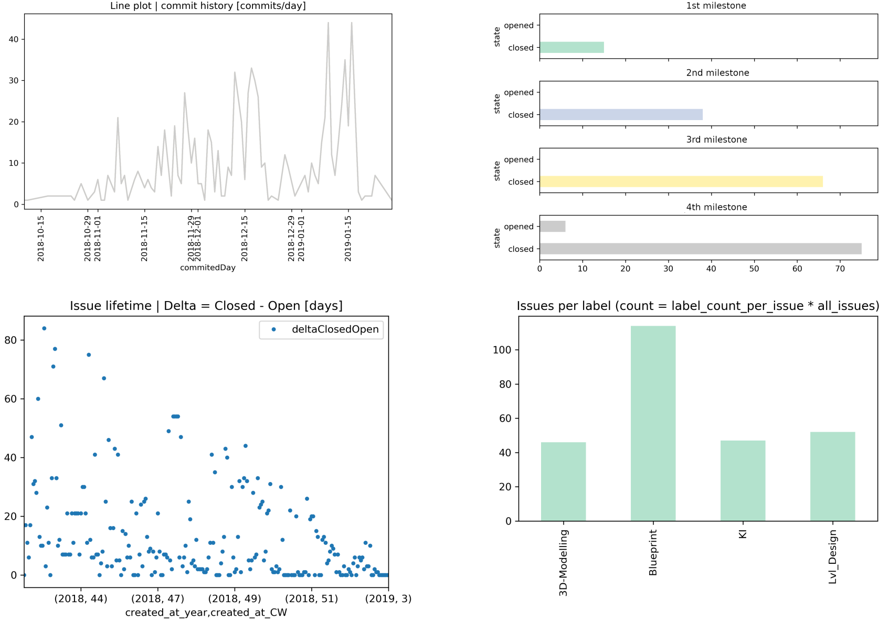

# Repository Statistics Analyser (ReStA) - A Repository Statistics Visualiser and Aggregator

> Keep an overview over your project.
> Download, process and visualise statistics about repositories. By default it visualises information about commits and issues. This should help you to manage your project and keep an overview.

<div align="center">

</div>

For the issue analysis you will get images and a `.csv` file containing the raw data. The `.csv` will have a structure like:

| index | assignee | assignees | author | closed_at | closed_by | confidential | created_at | description | discussion_locked | downvotes | due_date | id | iid | labels | merge_requests_count | milestone | project_id | state | time_stats | title | updated_at | upvotes | user_notes_count | web_url | created_at_CW | created_at_year | closed_at_CW | closed_at_year | label_<...> | label_enhancement | milestone_title |
|-------|----------|-----------|--------|-----------|-----------|--------------|------------|-------------|-------------------|-----------|----------|----|-----|--------|----------------------|-----------|------------|-------|------------|-------|------------|---------|------------------|---------|---------------|-----------------|--------------|----------------|-------------|-------------------|-----------------|

Example result images can be found in [example_img](./example_img).

## Getting started
Internally we use Git**Lab**'s Python library instead of the REST API. This means currently only GitLab is supported. For other platforms then GitLab code adaptions have to be made like using the REST API.

**In case you want or have to use the REST API** it would be a small change to modify the the code which takes care of this. Use pandas to convert the JSON response to a pandas DataFrame and rename some headers if necessary.

### Dependencies

* Curl (needed to download gerneric project information; otherwise not needed see [point one in chaptetr "run it"](#run-it))
* Python 3 
* Python packages (`pip3 install python-gitlab pandas matplotlib scikit-learn pypiscout`)
    * `python-gitlab`
    * `pandas`
    * `matplotlib`
    * `scikit-learn`
    * `pypiscout`


### Basic configuration
Running the bash script is optional. Alternatively you can just run the python script by itself.

#### Bash script
Provide a REST API-alike link as argument to the script or set the default variable `REPO_URL` wihtin the script.

#### Python script
Set the following variables within the python script `constants_settings.py` before you start:

```python3
TOKEN = r'<generate and insert your token here>'         # token name: <my token name>
PROJECT_ID = r'<insert the project ID here>'
```

All other settings are optional.

### Run it
Run `repo-stats.sh` in order to generate the reports. What it does:

1. Downloads and pretty print a JSON file (using the REST API and curl) containing general project information
2. Download, process and visualise issue and commit information (python script)
3. Visualise commit and issue information and dump all to a .csv file  (python script)


